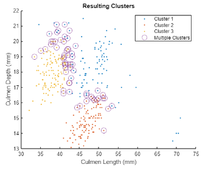
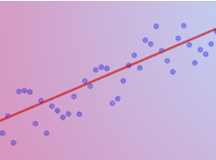

# Machine Learning Methods: Clustering

 or 

# Information

This curriculum module contains interactive [MATLAB® live scripts](https://www.mathworks.com/products/matlab/live-editor.html) that apply fundamental concepts and basic terminology related to clustering.

## Background

You can use these live scripts as demonstrations in lectures, class activities, or interactive assignments outside class. Clustering Basics covers distance-based, density based, and probabilistic algorithms including k-means, DBSCAN, and GMMs. It also includes examples of applying each algorithm to a data set containing beak measurements for different species of penguins.

The instructions inside the live scripts will guide you through the exercises and activities. Get started with each live script by running it one section at a time. To stop running the script or a section midway (for example, when an animation is in progress), use the  Stop button in the **RUN** section of the **Live Editor** tab in the MATLAB Toolstrip.

## Contact Us

Contact the [MathWorks teaching resources team](mailto:onlineteaching@mathworks.com) if you have a question or would like to provide any feedback.

## Prerequisites

This module assumes knowledge of basic statistics and probability, including Gaussian distributions and Bayes' theorem. If you would like to refresh your knowledge on these topics, more courseware on Gaussian distributions can be found [here](https://matlab.mathworks.com/open/github/v1?repo=MathWorks-Teaching-Resources/Descriptive-Stats-and-Probability&project=StatsAndProb.prj&file=continuousDistributions.mlx), and more courseware on Bayes' theorem can be found [here](https://matlab.mathworks.com/open/github/v1?repo=MathWorks-Teaching-Resources/Probability-Theory&project=Probability.prj&file=inferenceBayes.mlx). There is minimal MATLAB knowledge required for these scripts, but you can use [MATLAB Onramp](https://matlabacademy.mathworks.com/details/matlab-onramp/gettingstarted) as a resource to acquire familiarity with live scripts and MATLAB syntax.

## Getting Started
### Accessing the Module
### **On MATLAB Online:**

Use the  link to download the module. You will be prompted to log in or create a MathWorks account. The project will be loaded, and you will see an app with several navigation options to get you started.

### **On Desktop:**

Download or clone this repository. Open MATLAB, navigate to the folder containing these scripts and double-click on [MLMethodsClustering.prj](MLMethodsClustering.prj). It will add the appropriate files to your MATLAB path and open an app that asks you where you would like to start. 

Ensure you have all the required products ([listed below](#H_E850B4FF)) installed. If you need to include a product, add it using the Add-On Explorer. To install an add-on, go to the **Home** tab and select   **Add-Ons** > **Get Add-Ons**. 

## Products

MATLAB® is used throughout. Tools from the Statistics and Machine Learning Toolbox™ are used frequently as well.

# Scripts

## [**ClusteringIntro.mlx**](Scripts/ClusteringIntro.mlx) 

**In this script, students will...**

 $\bullet$ Learn what clustering is and what types of problems it can be applied to

 $\bullet$ Explore a step-by-step example of using k-means to cluster random data

 $\bullet$ Apply k-means to a real world data set, optimizing parameters along the way

**Academic disciplines**

 $\bullet$ Machine Learning

 $\bullet$ Artificial Intelligence

## [**ClusteringMethods.mlx**](Scripts/ClusteringMethods.mlx) 

**In this script, students will...**

 $\bullet$ Learn about two more clustering methods: DBSCAN and GMMs

 $\bullet$ Work through step-by-step examples of applying each algorithm to an example data set

 $\bullet$ Cluster the same real world data set using each method, considering their pros and cons

 $\bullet$ Learn about a variety of methods to evaluate clustering results

**Academic disciplines**

 $\bullet$ Machine Learning

 $\bullet$ Artificial Intelligence

 $\bullet$ Statistics

## Related Courseware Modules

## [**Regression Basics**](https://www.mathworks.com/matlabcentral/fileexchange/93435-regression-basics)

**Available on:**

[GitHub](https://github.com/MathWorks-Teaching-Resources/Regression-Basics)

## [**Machine Learning for Regression**](https://www.mathworks.com/matlabcentral/fileexchange/95903-machine-learning-for-regression)

**Available on:**

[GitHub](https://github.com/MathWorks-Teaching-Resources/Machine-Learning-for-Regression)

Or feel free to explore our other [modular courseware content](https://www.mathworks.com/matlabcentral/fileexchange/?q=tag%3A%22courseware+module%22&sort=downloads_desc_30d).

# Educator Resources
   -  [Educator Page](https://www.mathworks.com/academia/educators.html) 

Copyright 2023 The MathWorks™, Inc

